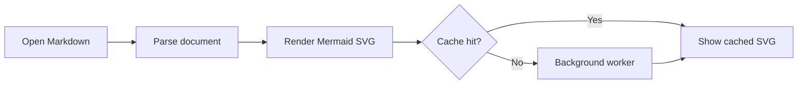
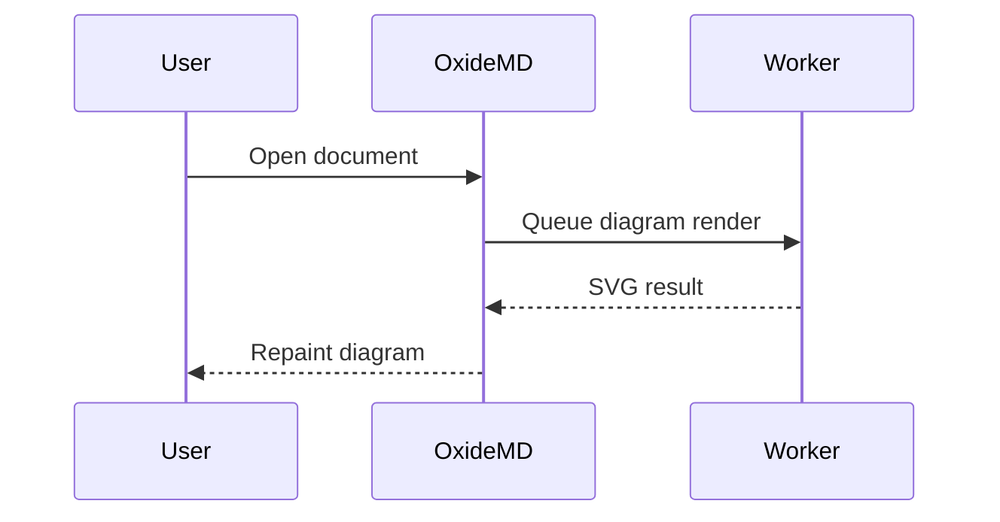
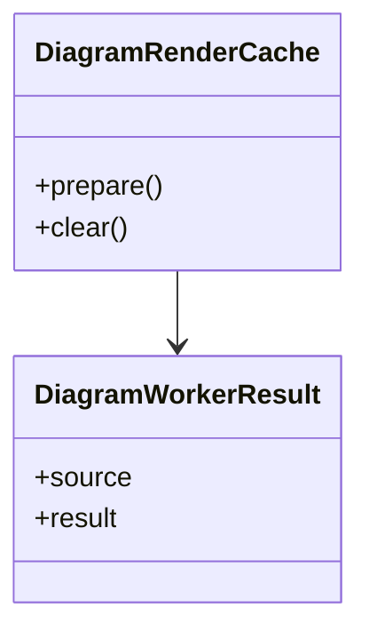
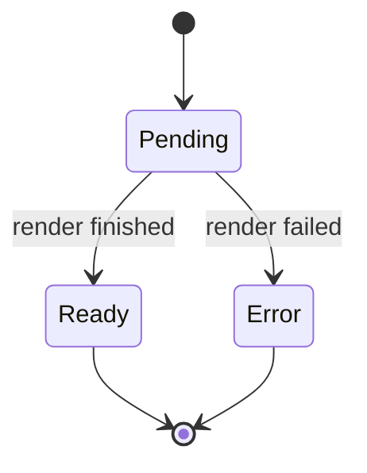
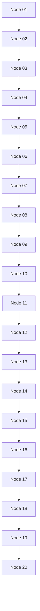

# Mermaid Rendering Evaluation

Use this file for manual Mermaid rendering checks and perf log sampling.

## Flowchart



## Sequence



## Class



## State



## Invalid

```mermaid
flowchart TD
    Broken -->
```

## Larger Flowchart


