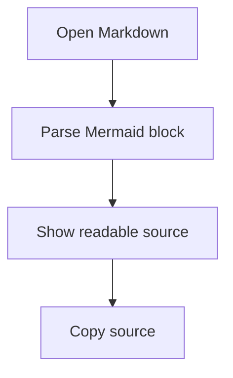

# Mermaid Diagram Fallback

This file checks Mermaid fenced block handling before SVG rendering is available.



Text after the diagram should keep normal document spacing.

```mmd
sequenceDiagram
    participant User
    participant OxideMD
    User->>OxideMD: Open file
    OxideMD-->>User: Show fallback
```
