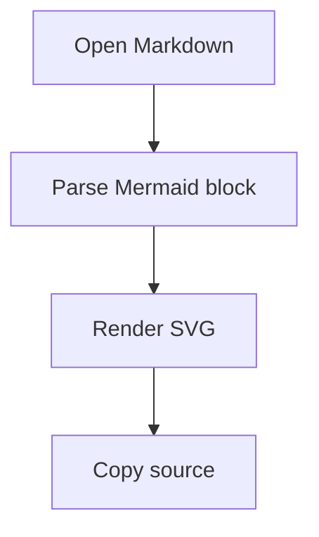

# Mermaid Diagrams

This file checks Mermaid fenced block rendering, fallback display, and source copying.



Text after the diagram should keep normal document spacing.

```mmd
sequenceDiagram
    participant User
    participant OxideMD
    User->>OxideMD: Open file
    OxideMD-->>User: Show diagram
```

Invalid diagrams should keep a readable source fallback:

```mermaid
graph TD
    A --> 
```
